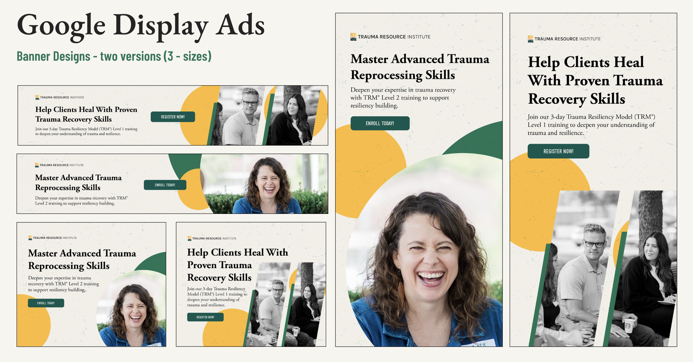
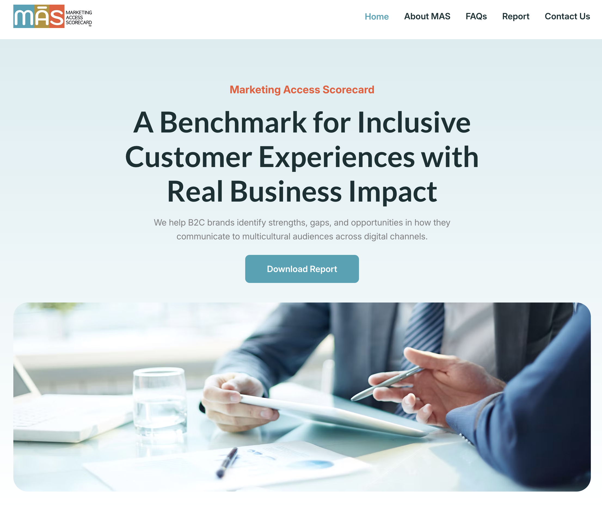

## **Trauma Resource Institute**

### **Project Overview:**

As part of a collaborative team project with the Trauma Resource Institute. The project focused on developing a Google Ads marketing campaign to support the Community Resiliency Model (CRM), Trauma Resiliency Model (TRM), and donation initiatives. The work involved creating a cohesive ad strategy that combined ad design, keyword research, and optimized landing page content to attract and engage potential program participants.

### **The Goals:**

-   Increase TRM & CRM program awareness among targeted audiences.

-   Drive high-quality traffic to the landing page by leveraging the Google Ad Grants. program for nonprofit search advertising.

-   Improve conversion rates through strategic ad copy and landing page design.

### **My Role & Responsibilities:**

-   Conducted competitor and SWOT analysis to evaluate positioning and identify strategic opportunities.

-   Created display ad designs for future advertising campaigns.

-   Designed the CRM program landing page with a user-friendly layout and clear messaging to effectively engage and connect with the target audience.

-   Conducted keyword research for the CRM program’s search ads campaign by identifying high-intent keywords to improve targeting and attract relevant users.

------------------------------------------------------------------------

## **Garcia Research**

### **Project Overview:**

This project was completed as part of the culminating experience project in collaboration with Garcia Research. The project focused on the Marketing Access Score (MAS), a framework that evaluates how well B2C websites support Spanish language accessibility. The project involved designing a website that clearly communicates the value of the MAS research and promote it to organizations interested in improving their DEI efforts.

### **The Goals:**

-   Evaluate B2C websites for Spanish-language accessibility by scoring them using the MAS framework and create industry reports to communicate findings.

-   Increase awareness of the MAS framework among B2C organizations through the dedicated website and a social media content strategy.

-   Design a website that attracts and informs stakeholders who are looking to make their marketing more inclusive.

### **My Role & Responsibilities:**

-   Conducted competitor analysis to understand how similar market research companies position their inclusive marketing services and benchmarking scoring methods.

-   Designed the website experience by developing a user-friendly structure that attracts marketing teams and raises awareness of the MAS as a service for improving B2C Spanish-language accessibility.

-   Evaluated website performance to identify opportunities for improvement in user engagement and conversion optimization.