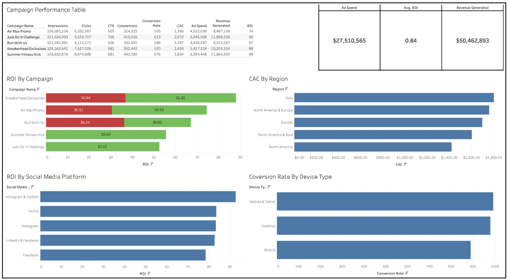

## **NCMA-SGV**

### **Project Overview:**

This project was in collaboration with NCMA-SGV, where website performance using Google Analytics 4 data was analyzed. The dataset was exported into BigQuery, where it was queried to identify user behavior patterns, traffic sources, and engagement metrics. The project also involved exploratory data analysis in R  and an interactive Looker Studio dashboard to visualize key insights. The final deliverable provided stakeholders with a clear view of website performance across dimensions such as traffic channels, device types, geographic distribution, and engagement trends over time.

### **The Goals:**

-   Analyze GA4 data to identify meaningful insights about user behavior, engagement trends, and traffic sources in order to better understand overall website performance.

-   Build an efficient data workflow using BigQuery and r programming that enables querying, transformation, and reporting of key metrics

-   Design an interactive dashboard that allows stakeholders to easily evaluate KPIs and make informed data-driven decisions.

### My Role & Responsibilities:

-   Conducted exploratory and statistical analysis in R by connecting to BigQuery and using packages like bigrquery, DBI, dplyr, and ggplot2 to explore the data and identify patterns and trends over time.

-   Built an interactive Looker Studio dashboard to display key metrics like sessions, engagement rate, traffic sources in a visually clear format. 

## NCMA-SGV Revealjs Presentation

## **Nike Marketing Campaign Performance Dashboard**

This project was completed as part of coursework using a simulated Nike marketing dataset to analyze campaign performance across multiple channels. The dataset included key metrics such as impressions, clicks, conversions, ad spend, revenue, ROI, and customer acquisition cost (CAC).

Using Tableau, I developed an interactive dashboard to evaluate campaign effectiveness across dimensions like region, social media platform, and device type. The analysis highlighted how different campaigns performed in terms of profitability, conversions, and marketing spend which helped provide an in-depth overview of the campaign’s digital marketing performance.

### The Goals

-   Analyze campaign performance data to understand how marketing efforts impact revenue, ROI, and customer acquisition across different channels and regions.

-   Identify high-performing campaigns, platforms, and device types by comparing key metrics such as conversion rate, CAC, and ROI.

-   Design an interactive Tableau dashboard that clearly communicates campaign performance insights.

### My Role & Responsibilities

-   Built an interactive Tableau dashboard to visualize campaign performance metrics, including ROI, CAC, conversion rates, and revenue across multiple dimensions

-   Analyzed the dataset to identify key trends, patterns, and performance differences across campaigns, regions, and marketing platforms

-   Interpreted findings and developed actionable recommendations to improve marketing effectiveness based on data insights

## GA4 Traffic Data